# GIT Essentials 
## Git is a VCS (Version Control System) tool:
  - It is used for versioning your code, which means keeping a history of different versions.
  - It allows developers to work in parallel on different features of the same application code without overwriting each other's projects.
  - Share your work on platforms like GitHub.

  
## Key Concepts
#### *Repository (repo)* - your project's folder 
#### *Commit* - A saved snapshot of your changes, like a checkpoint
#### *Branch* - A parallel version of your project for isolated work
#### *Merge* - combining changes from two branches
#### *Remote* - A copy of your repo hosted online (e.g., GitHub)
#### *Clone* - Downloading a remote repo to your machine

- Working Directory - where you edit files on your computer. Untracked changes live here.
- Staging Area - a "preparation zone". You choose which files go into your next commit with git add.
- Local Repository - your personal commit history, saved on your machine.
- Remote Repository - the shared copy on GitHub/GitLab. git push uploads; git pull downloads.

## Getting Started

### Part 1 — Setting up Git (one time only)
#### Step 1: Install Git
Download Git from [https://git-scm.com](https://git-scm.com) and install it.
Open your terminal (Mac/Linux) or Git Bash (Windows).

#### Step 2 — Tell Git who you are
Type these two commands (replace with your real name and email, which you need to use further):
``git config --global user.name "Maria Santos" ``
``git config --global user.email "maria@example.com"``

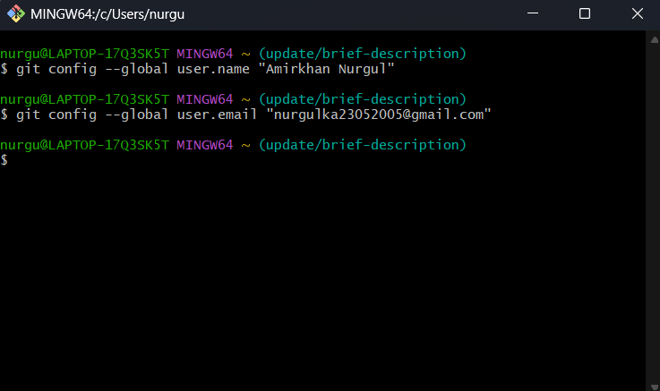

### Part 2 — Creating your first repository on GitHub
GitHub is the online home for your Git projects. Think of it as Google Drive, but built for code.
#### Step 3 — Create a GitHub account
Go to [https://github.com](https://github.com) and sign up (it's free).

#### Step 4 — Create a new repository

Click the green "New" button on your GitHub homepage
Fill in the form:

- Repository name: my-ds-project
- Description: My first data science project
- ✅ Check "Add a README file"
- ✅ Check "Add .gitignore" → choose Python from the dropdown
- Click "Create repository"

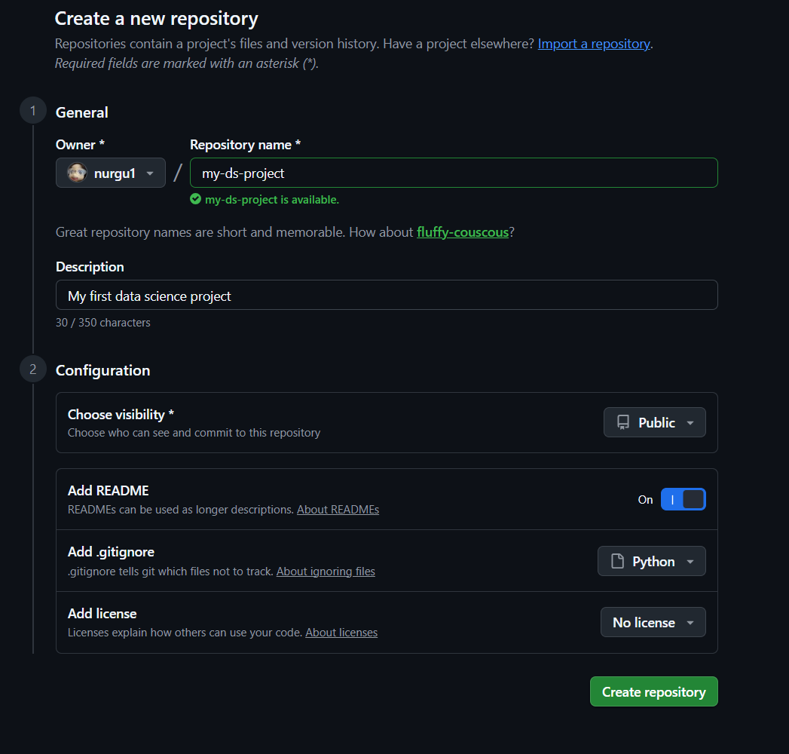

#### Step 5 — Copy your repository link
On your new repo page, click the green "Code" button and then copy the HTTPS link.

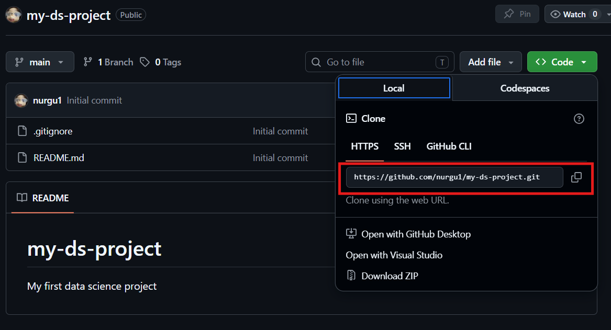

### Part 3 - Getting the repo onto your computer
#### Step 6 - Clone the repository
*"Cloning"* means downloading a copy of the repo to your computer.
In your terminal, navigate to where you want to save the project (e.g. your Desktop):
bash
``cd Desktop``
``git clone https://github.com/your-username/my-ds-project.git``
``cd my-ds-project``

You now have a folder called my-ds-project on your Desktop. Open it and you will see a README.md file already inside!!!

### Part 4 - Saving your work (the daily workflow)
This is what you will do every single day. Learn these 4 commands by heart 
#### Step 7 — Check what has changed
After creating or editing a file (for example, a new notebook eda.ipynb), run in bash:
``git status``

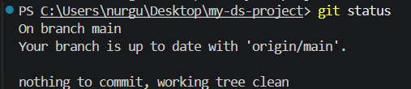
- 🔴 Red files = Git sees them but is not tracking them yet
- 🟢 Green files = staged and ready to be committed

#### Step 8 — Stage your files
"Staging" means telling Git: "I want to include this file in my next save."
bash
``git add project.py``
Or to stage all changed files at once:
bash
``git add .``
Run ``git status`` again to confirm:
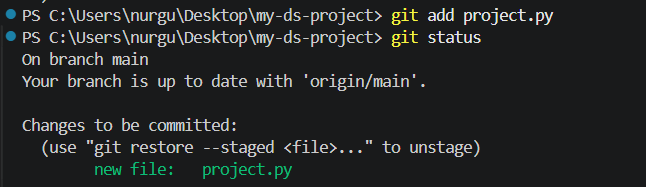

#### Step 9 — Commit your changes

A commit is like hitting "Save Game" — it creates a permanent checkpoint.
bash
``git commit -m "Add my first data science project"``

!!! Write your commit message like you are finishing the sentence: "This commit will..."

✅ "Add EDA notebook for sales data"
✅ "Fix null values in preprocessing step"
❌ "stuff" or "update" or "asdfgh"

 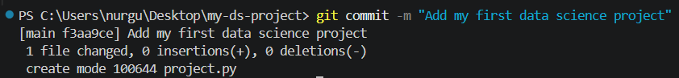

#### Step 10 — Push to GitHub
"Pushing" uploads your commits to GitHub so your team can see them.
bash
``git push``

 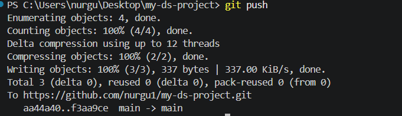

Now go to your GitHub repo page and refresh so your file will be there! 

### Part 5 — Working with branches
A branch lets you work on new ideas without touching the main project. Think of it as a safe sandbox.
**Rule #1: Never work directly on the main branch.**
#### Step 11 — Create and switch to a new branch
bash
``git checkout -b feature/logistic-regression``

This creates a new branch AND switches to it in one command.
 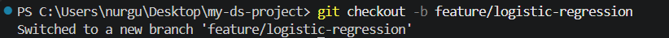

Do your work on this branch (add files, make commits). When you are done, push it:
``git push origin feature/logistic-regression``

### Part 6 - Collaborating on GitHub (Pull Requests)
**A Pull Request (PR)** is how you ask your teammates to review your work before merging it into the main project.
#### Step 13 — Open a Pull Request
- Go to your repo on GitHub
- You will see a yellow banner: "feature/logistic-regression had recent pushes"
- Click "Compare & pull request"
- Write a short description of what you did
- Click "Create pull request"

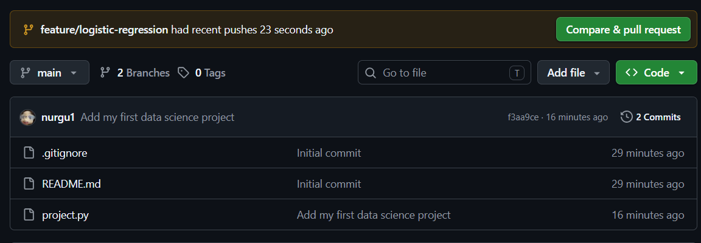

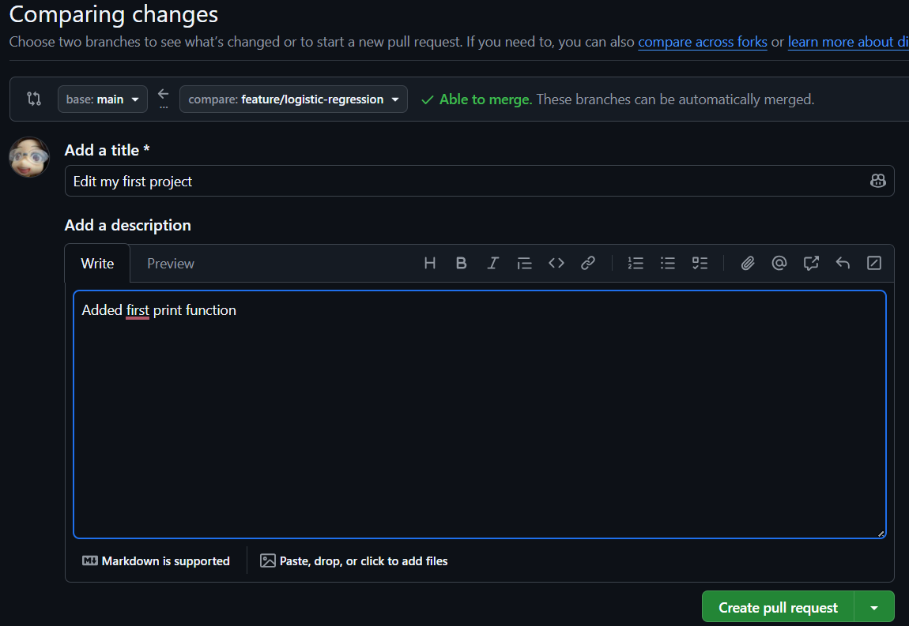

#### Step 14 — Merge the Pull Request
Once your teammate approves (or if you are working alone):
- Click "Merge pull request"
- Click "Confirm merge"
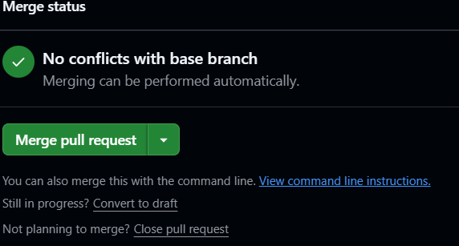

### Part 7 — Git for Data Science specifically
The .gitignore file -  what NOT to track
Some files should never go into Git:

- Large datasets (.csv, .parquet) — too big, slow everything down
- Model files (.pkl, .h5) — can be hundreds of MB
- Secret keys and passwords (.env)
- Temporary files (__pycache__/, .ipynb_checkpoints/)
The .gitignore file tells Git to ignore these automatically.

#### Step 15 — View your .gitignore
Open .gitignore in VS Code or any text editor. Since you chose "Python" when creating the repo, it already ignores common Python files. Add data science specific entries:
- Add these lines to your .gitignore
data/raw/
data/processed/
*.csv
*.parquet
*.pkl
models/
.env

### Part 8 — Fixing mistakes
**Accidentally changed a file**  
``git checkout -- filename`` - Restores the file to last commit
**Staged a file by mistake**   
``git reset HEAD filename`` - Unstages it (but keeps your changes)
**Bad commit message** 
``git commit --amend -m "Better message"`` - Rewrites the last commit message
**Need to undo last commit** 
``git reset --soft HEAD~1`` - Undoes commit but keeps your files
**Want to save work temporarily**
``git stash`` - Hides your changes for later
**Get your stashed work back** 
``git stash pop`` - Brings back hidden changes
