# GIT Essentials 
## Git is a VCS (Version Control System) tool:
  - It is used for versioning your code, which means keeping a history of different versions.
  - It allows developers to work in parallel on different features of the same application code without overwriting each other's projects.
  - Share your work on platforms like GitHub.

  
## Key Concepts
#### *Repository (repo)* - your project's folder 
#### *Commit* - A saved snapshot of your changes, like a checkpoint
#### *Branch* - A parallel version of your project for isolated work
#### *Merge* - combining changes from two branches
#### *Remote* - A copy of your repo hosted online (e.g., GitHub)
#### *Clone* - Downloading a remote repo to your machine

- Working Directory - where you edit files on your computer. Untracked changes live here.
- Staging Area - a "preparation zone". You choose which files go into your next commit with git add.
- Local Repository - your personal commit history, saved on your machine.
- Remote Repository - the shared copy on GitHub/GitLab. git push uploads; git pull downloads.

## Getting Started

### Part 1 — Setting up Git (one time only)
#### Step 1: Install Git
Download Git from [https://git-scm.com](https://git-scm.com) and install it.
Open your terminal (Mac/Linux) or Git Bash (Windows).

### Step 2 — Tell Git who you are
Type these two commands (replace with your real name and email, which you need to use further):
``git config --global user.name "Maria Santos" ``
``git config --global user.email "maria@example.com"``

